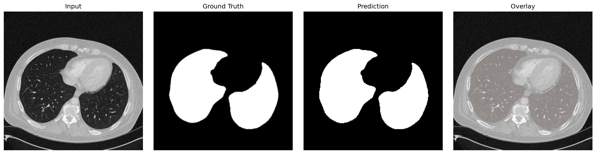
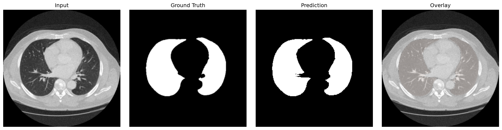

# Lung CT Image Segmentation with U-Net

PyTorch implementation of the classic U-Net architecture built from scratch for binary lung segmentation on 32-bit thoracic Computerized Tomography (CT) scans.

---

## Highlights & Results
* **Architecture:** Pure PyTorch implementation of the U-Net contracting-expansive path with skip connections.
* **Medical Domain Knowledge:** Solved the contrast degradation issue on 32-bit signed Hounsfield Unit (HU) CT data by applying **Lung Windowing (`[-1000, 400] HU`)** instead of naive 8-bit clipping.
* **Custom Loss Function:** Combined Binary Cross Entropy with Dice Loss (`DiceBCELoss`).
* **Test Performance (41 Unseen CT Slices):**
  * **Mean IoU (Jaccard Index):** `94.70%`
  * **Mean Dice Coefficient (F1 Score):** `96.71%`

---

## Qualitative Results

Here is a side-by-side comparisons showing the Input CT, Ground Truth Mask, Model Prediction, and Colored Overlap:



---

## Project Structure

```text
├── data/                  # CT scans and masks (ignored in git)
├── output/
│   ├── predictions/       # Saved binary mask predictions
│   └── comprasion/        # 4-panel visual comparison figures
├── scripts/
│   ├── data_split.py      # Deterministic train/val/test splitter
│   └── data_visualize.py  # Matplotlib 4-panel overlap visualizer
├── src/
│   ├── model.py           # Vanilla U-Net architecture from scratch
│   ├── data_preperation.py# HU Windowing, Albumentations transforms & Dataset
│   ├── dataloader.py      # PyTorch DataLoader wrappers
│   ├── loss_function.py   # Custom DiceBCELoss
│   ├── metrics.py         # IoU & Dice calculation functions
│   ├── train.py           # Training & validation loop
│   └── predict.py         # Single & batch inference pipeline
├── weights/               # Trained checkpoints (100epochs.pt)
└── requirements.txt       # Dependencies